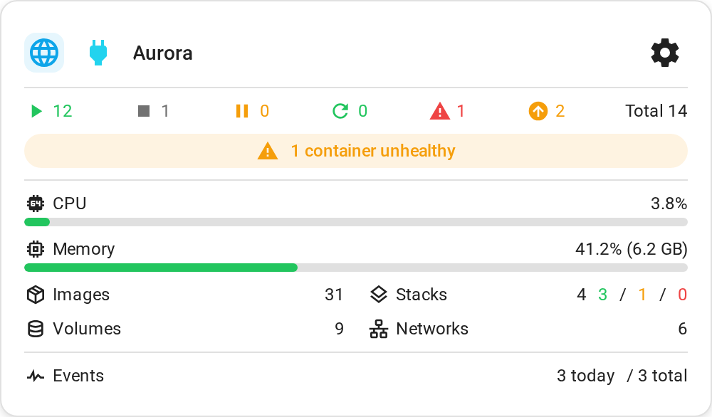
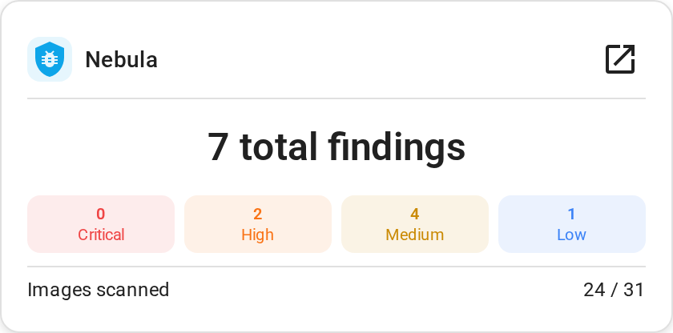
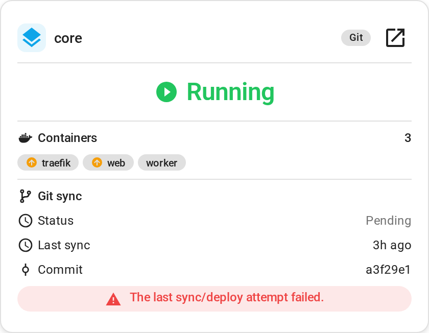
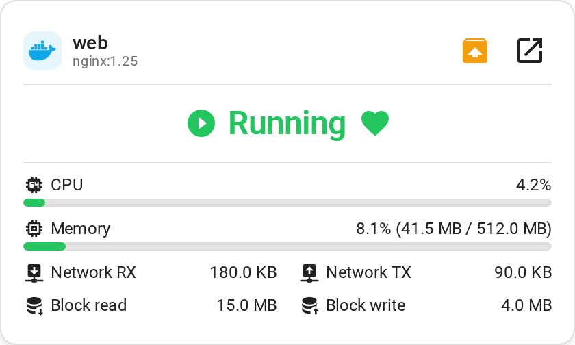
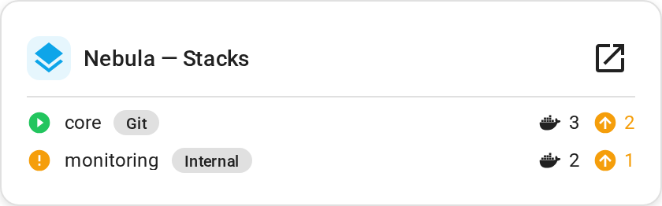
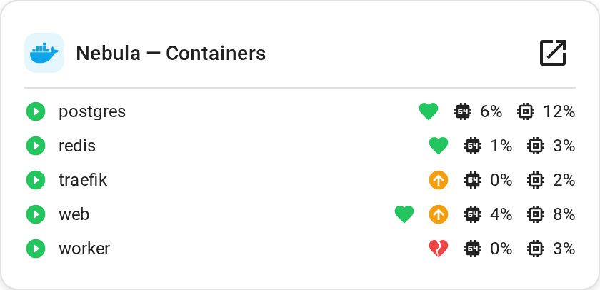
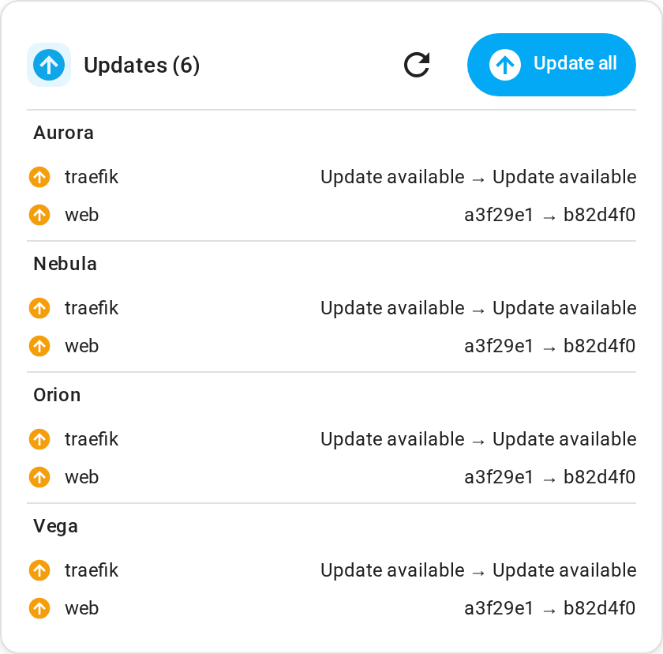
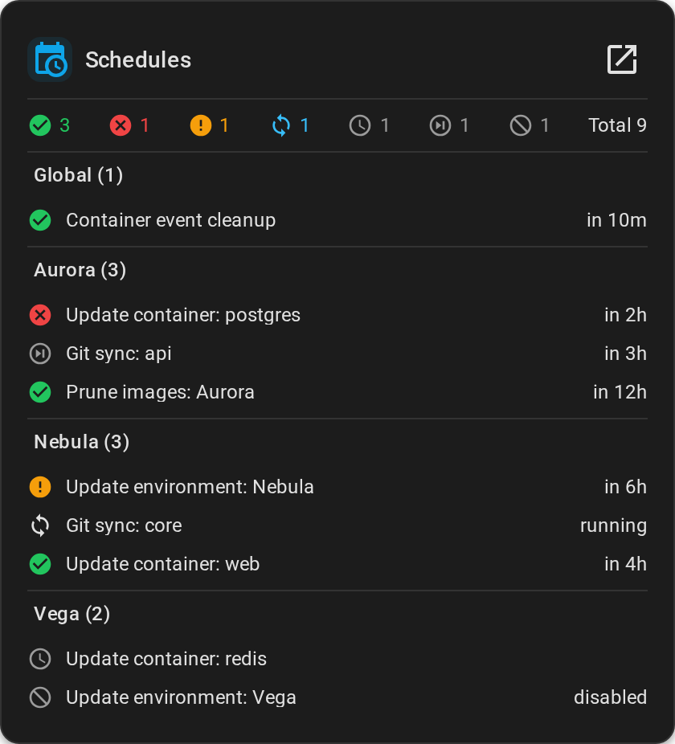
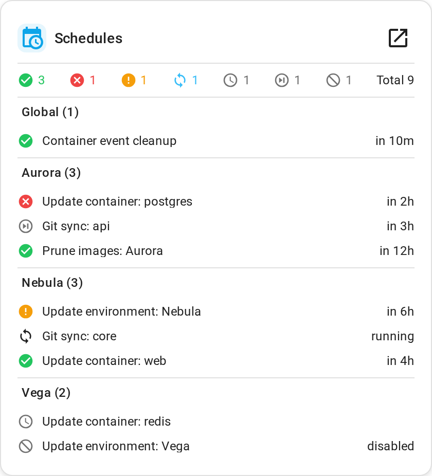

# ha-dockhand-cards

[](https://github.com/hacs/default)
[](https://github.com/raetha/ha-dockhand-cards/releases)
[](https://github.com/raetha/ha-dockhand-cards/actions/workflows/ci.yml)

Lovelace cards for [ha-dockhand](https://github.com/raetha/ha-dockhand), modeled directly on
[Dockhand](https://github.com/Finsys/dockhand)'s own UI rather than reverse-engineered from
screenshots.

This is a **frontend resource repo** (HACS "Plugin" category), separate from ha-dockhand's
"Integration" repo — a Lovelace card is browser JavaScript, not a Python `custom_components`
platform, even though it's designed to be used alongside it.

It's a monorepo by design, following the same pattern as [Mushroom](https://github.com/piitaya/lovelace-mushroom):
one HACS entry, one bundled JS file, multiple card types registered inside it.

See `docs/QUALITY.md` for the checklist this repo is held to, `docs/BACKLOG.md` for deliberately
deferred items and future card ideas, `docs/ARCHITECTURE.md` for how the pieces fit together and
why, `docs/STYLING.md` for theming/card_mod customization, and `CONTRIBUTING.md` for development
setup and the release process.

---

## Requirements

- **Home Assistant 2026.6 or later.** This is what's actually been tested against, not a
  theoretical minimum — the editors are built on HA's own `<ha-form>`, which itself depends on
  `ha-select`/`ha-input`'s modern API (substantially rewritten as part of HA's frontend
  design-system migration); older HA versions may not run them correctly. Enforced via
  `hacs.json`'s `homeassistant` field.
- **ha-dockhand 1.8.0 or later** — the Vulnerability card, the environment card's
  connection-type icon, detailed/full mode's disk usage view, and the stack card's list of member
  container names all depend on entities added in that release. HACS doesn't support declaring a
  dependency on another custom repository, so this isn't enforced automatically; everything else
  degrades gracefully on an older ha-dockhand (see `docs/ARCHITECTURE.md` §1 for why), but those
  specific features simply won't have data yet. **ha-dockhand 1.8.2 or later** if you use "Hide
  when no updates" and have a system container with its own pending update — older releases
  undercount that specific case rather than breaking (see `CHANGELOG.md`). **ha-dockhand 1.9.0 or
  later** for the Schedules card's own environment-scoped device grouping — on an older release
  the card still works, just showing every schedule as if every environment were included.

## Installation

### HACS (Recommended)

This repository is available in the default HACS catalog.

1. Open HACS in Home Assistant
2. Go to **Frontend**
3. Search for **Dockhand Cards** and install it
4. Add the Lovelace resource if HACS didn't do it automatically

[](https://my.home-assistant.io/redirect/hacs_repository/?owner=raetha&repository=ha-dockhand-cards&category=plugin)

### Manual

1. Download `ha-dockhand-cards.js` from the [latest release](https://github.com/raetha/ha-dockhand-cards/releases)
2. Copy it into `<HA config>/www/`
3. Add it as a Lovelace resource: `/local/ha-dockhand-cards.js`, type: **JavaScript Module**

---

## Cards

All nine cards share the same principles: **zero manual entity configuration** — pick a device
(or, for the multi-environment cards, one or more) from the editor, and the card resolves the
entities it needs itself. **No credentials of their own** — they only ever read `hass.states`/`hass.entities`/
`hass.devices`, same trust boundary as any other Lovelace card; nothing calls Dockhand's API
directly. **Graceful everywhere** — a disabled or not-yet-existing entity means that value or
section is simply left out, never a broken layout or a thrown error. **Click-through** — every
value backed by a real entity opens that entity's more-info dialog. **Icons follow your
customization** — anywhere a value maps 1:1 to an entity, its icon comes from `<ha-state-icon>`,
so changing an entity's icon in Home Assistant updates the card automatically.

Screenshots below use entirely fictional data (a made-up "Nebula" environment, invented
container/stack names) — see `tools/screenshot-harness/` if you want to regenerate them or
capture your own with different mock data.

### Dockhand Environment Card

```yaml
type: custom:dockhand-environment-card
device_id: <environment device>
mode: standard # compact | standard | detailed | full | custom
custom_sections: [container_counts, metrics, resources, events_summary] # only used when mode: custom
name: null # optional — Composed (built from the device's Area/Device/Floor) or Custom (plain text);
           # leave unset for the device's own name, same as every other card's default
show_settings_link: true # link to open this environment in Dockhand
```

Compact (name/online/counts), Standard (+ CPU/memory, health, resource counts, events — matches
Dockhand's own 1x2 dashboard tile), Detailed (+ top containers by CPU and recent events), Full
(+ a disk usage breakdown and a 15-minute CPU/memory history chart, matching Dockhand's own
window), or Custom — pick exactly which of those sections to show, independent of the four fixed
combinations above (e.g. just the summary and CPU/memory/disk sections without either list).

<p>
  
  
</p>

<details>
<summary>Compact, detailed, and full modes</summary>
<p>
  
  
  
</p>
</details>

### Dockhand Vulnerability Card

```yaml
type: custom:dockhand-vulnerability-card
device_id: <environment device>
name: null # optional — Composed or Custom, same as the Environment card's own Name field
show_settings_link: true # link to view vulnerabilities in Dockhand
```

Total findings plus a critical/high/medium/low breakdown (Dockhand's own severity colors) and scan
coverage. Needs ha-dockhand's `sensor.vulnerabilities` (disabled by default) enabled, and
vulnerability scanning turned on for that environment in Dockhand.

<p>
  
  
</p>

### Dockhand Stack Card

```yaml
type: custom:dockhand-stack-card
device_id: <stack device>
name: null # optional — Composed or Custom, same as every other card's Name field
show_settings_link: true # link to open this stack in Dockhand
visible_sections: [status, containers, git_sync] # which sections show, independent of each other
```

Status (running/partial/stopped/created), container count, pending-update badge, and — for
git-tracked stacks only — sync status, last sync time, and a sync-error banner. Each member
container gets its own pill, linking to that container's own status entity when it can be
resolved.

<p>
  
  
</p>

### Dockhand Container Card

```yaml
type: custom:dockhand-container-card
device_id: <container device>
name: null # optional — Composed or Custom, same as every other card's Name field
show_settings_link: true # link to open this container in Dockhand
visible_sections: [state, metrics, io] # which sections show, independent of each other
```

State, health (when the container has a healthcheck), CPU/memory usage, and network/block I/O.
CPU/memory and per-container I/O sensors are opt-in in ha-dockhand and off by default — the card
shows a hint rather than a blank chart when they're not enabled. CPU, memory, and the health icon
each open their own entity's more-info dialog — not just the container's overall state.

<p>
  
  
</p>

*The Stack and Container cards don't have a Dockhand dashboard tile to model directly — Dockhand
only shows this level of detail on its full stack/container detail pages, which have far more
going on than a dashboard card should. What's here is a first pass at "what's actually useful at a
glance"; feedback on what to add, cut, or rearrange is genuinely wanted.* Naming convention across
this repo: singular ("Stack", "Container") means one item; plural ("Stacks", "Containers") means
every item of that type for one environment.

### Dockhand Stacks Card

```yaml
type: custom:dockhand-stacks-card
environments_order: [] # device ids, display order — which environments are included (paired
                        # with exclude_device_ids) and what order groups display in when
                        # group_by: environment. Everything included by default until something's
                        # excluded.
exclude_device_ids: [] # nothing excluded by default
name: null # optional — Composed or Custom, same as every other card's Name field
show_settings_link: true # link to view stacks in Dockhand
visible_badges: [container_count, updates, type] # which per-row details to show, independent of
                                                   # each other — add `environment` to show each
                                                   # row's environment as a name-adjacent pill,
                                                   # useful once more than one environment is included
group_by: environment # none | environment | status | type
sort_by: name # name | status
```

Every stack across one environment, several, or all of them — one compact row each (type, status,
container count, pending updates). Auto-detects every stack device for the environments included.
Each per-row detail (container count, the "updates available" badge, the stack-type pill, and —
once more than one environment is included — an environment pill) can be turned off independently
via "Row details" in the editor if you don't want it cluttering the list.

A config saved with the older single-environment `device_id` field (from before this card supported
several) keeps working exactly as before — it's read as "just this one environment," computed
fresh each time rather than rewritten. The moment you touch the Environments section in the editor
(drag, exclude, or solo), it upgrades to `environments_order`/`exclude_device_ids` from then on.

<p>
  
  
</p>

### Dockhand Containers Card

```yaml
type: custom:dockhand-containers-card
environments_order: []
exclude_device_ids: []
name: null # optional — Composed or Custom, same as every other card's Name field
show_settings_link: true # link to view containers in Dockhand
visible_badges: [health, updates, cpu, memory] # add `environment` to show each row's environment
                                                # as a name-adjacent pill
group_by: environment # none | environment | status
sort_by: name # name | status
```

Every container across one environment, several, or all of them — one compact row each (state,
health, CPU/memory when those sensors are enabled). Same multi-environment support, "Row details"
control, and legacy `device_id` compatibility as the Stacks card above.

<p>
  
  
</p>

### Dockhand Updates Card

```yaml
type: custom:dockhand-updates-card
group_by: environment # none | environment
environments_order: [] # device ids, display order — which environments are included (paired
                        # with exclude_device_ids) and what order their groups display in.
                        # Everything included by default until something's excluded.
exclude_device_ids: []
name: null # optional — Composed or Custom, same as every other card's Name field
hide_when_no_updates: false # uses HA's own card visibility condition - genuinely hidden, not just empty, and still shows normally while editing the dashboard
```

Every pending container update — across every environment, a chosen subset, or just one — with a
bulk "Update all" action (presses ha-dockhand's own per-environment "Update all" button entity, so
it's the exact same batch semantics as clicking it in Dockhand itself: system containers excluded,
matches Dockhand's own count). Each row opens that container's own `update` entity more-info for a
targeted install instead. Grouped by environment by default (`group_by: none` flattens every
environment's own updates into a single sorted list instead — the bulk "Update all" button still
presses every environment's own button either way, since that's a single card-level action, not
one tied to how the rows themselves are arranged); the group header itself only shows once more
than one environment is included, and the `group_by` field itself is hidden entirely when this
card is embedded (Overview's own per-environment columns, a fixed single-environment context where
both options would produce the same result).

A config saved with the older `scope`/`device_id` fields (`scope: all`/`scope: environment`, real
and released before this card supported the same Environments section every other multi-
environment card now does) keeps working exactly as before, the same legacy compatibility the
Stacks/Containers cards have.

<p>
  
  
</p>

### Dockhand Schedules Card

```yaml
type: custom:dockhand-schedules-card
group_by: environment # none | environment | type | status
sort_by: status # name | next_run | status
environments_order: [] # device ids, display order — which environments are included (paired
                        # with exclude_device_ids) and what order groups display in when
                        # group_by: environment. Everything included by default until something's
                        # excluded — see below.
exclude_device_ids: [] # nothing excluded by default
include_global: true # whether global schedules (system cleanup, destination maintenance — the
                      # ones with no environment at all) show alongside the chosen environments
name: null # optional — Composed or Custom, same as every other card's Name field
show_settings_link: true # link to view schedules in Dockhand
show_stats: true # icon+count row (success/failed/warning/running/queued/skipped/disabled/total)
visible_badges: [next_run, environment] # which per-row details to show, independent of each
                                         # other — `environment` defaults to hidden specifically
                                         # when group_by: environment (redundant with the group
                                         # header otherwise), shown for every other grouping
```

Every schedule — container auto-updates, git stack syncs, environment update checks, image
prunes, backups, and system jobs — for one environment, several, or all of them (needs ha-dockhand
1.9.0+ for the environment-scoped grouping this relies on; older releases still work, everything
just shows as if every environment were included). Each row shows current status, next run (or
last run/disabled, depending), and its environment pill when shown.

There's no `scope` field — an earlier version of this card had one (`all`/`selected`/
`environment`/`global`), but it turned out to just be a redundant layer on top of what
`environments_order`/`exclude_device_ids` already express on their own: "all" is nothing excluded,
"one environment" is excluding every other one, "some" is excluding a few, "none" is excluding all
of them. The "Environments" editor section is always shown, always fully interactive:

- **Drag** to reorder (governs both display order when grouping by environment, and inclusion
  order generally) — only enabled when `group_by: environment`, since drag order has no effect
  otherwise; the handle still shows, just greyed out, rather than disappearing outright
- **Eye icon** to include/exclude one environment
- **Target icon** to "solo" one — include only this environment, excluding every other one in a
  single click (this is the fast path that used to be `scope: environment` + a device picker;
  it's actually one click instead of two now)
- **Show all / Clear** — bulk include-everything or exclude-everything, for building a
  small curated list from scratch without excluding everyone else one at a time

This mechanism (`environments_order`/`exclude_device_ids`, `resolveIncludedOrdered()` /
`renderEnvironmentOrderSection()` in `src/common/environment-scope.ts`) is shared infrastructure
— every multi-environment card in this repo (this one, Updates, Stacks, Containers, Overview) uses
the exact same component for it now, not a per-card copy.

The editor follows the card's own top-to-bottom visual order rather than grouping fields by
topic: the "Environments" section renders first (this card's own version of Tile's unwrapped
`entity` field — the "what is this card even of" answer, not a detail to tuck away), then
`include_global`, `group_by`, and `sort_by` right after it — decisions worth making the moment the
card's added, not defaults to leave alone. A single collapsed-by-default "Content" section holds
the rest — Name, the settings link, the stats-row toggle, and "Row details" (which per-row extras
show) — things most people will set once, if ever, and not need to revisit.

(Manually reordering the schedule *list itself* — the actual rows, not which environments are
included — was considered and deliberately not done: with potentially dozens of schedules that
change often, `sort_by`/`group_by` do a better job than hand-curated ordering would.)

<p>
  
  
</p>

### Dockhand Overview

```yaml
type: custom:dockhand-overview-card
show_environments: true
show_vulnerabilities: false # needs the Vulnerabilities sensor enabled per environment
show_updates: false
updates_hide_when_no_updates: false # hides just that environment's Updates card (genuinely, taking no space), not the others
show_schedules: false # needs ha-dockhand 1.9.0+ for per-environment schedule grouping; solo'd to each
                      # column's own environment automatically, with global (no-environment)
                      # schedules always excluded — showing those in every column would just repeat
                      # the same data
show_stacks: false
show_containers: false
```

Every embedded card type also has its own set of "global default" fields (Environment's own
`environment_mode`/`environment_custom_sections`, Stacks' own `stacks_visible_badges`, and so on
for each) — set through the editor's own pencil icon, not typically hand-written; see "A global
default per card type" below.

Intended to fill an entire dashboard view. One column per environment (sorted by name, or dragged
to a custom order in the editor), each column stacking whichever sections you've enabled — the
environment card, vulnerability card, Updates card, Schedules card, Stacks card, and Containers
card, in that order by default (also drag-to-reorder in the editor) — so everything about one
environment lives together instead of being split into separate rows per card type. Columns lay
out side by side on a wide screen and collapse to one column at a time, in the same order, on
mobile — a plain flex-wrap, no separate mobile layout to maintain.

Defaults to environments only — turn on Vulnerabilities/Updates/Schedules/Stacks/Containers if you
want them.
Kept deliberately minimal by default: with everything on, this card gets very tall very fast (every
section, for every environment), and there's no reliable way for the card to know it's being
shown small versus on a real dashboard (see `docs/ARCHITECTURE.md` if you're curious why), so the
default has to work reasonably either way. If you just want a clean per-environment overview,
this default is probably already what you want.

Beyond the per-section on/off toggles, the editor has two more layers of settings, both reached
from a pencil icon rather than hand-written YAML:

- **A global default per card type** — settings like display mode, which per-row details to show
  on the Stacks/Containers cards, group/sort order for cards that have it, and whether each card
  type's "open in Dockhand" link shows, set once and applied to every environment's generated card
  of that type. Reached via the pencil on each row in the editor's "Sections" list.
- **A per-environment override** — any of those same settings, plus a Name override, for one
  specific environment only, when you want that one environment's card to differ from the shared
  default. Reached via the pencil on each row in the editor's "Environments" list. Stored in the
  `environments_overrides` config key, keyed by device id — set through the editor, not typically
  hand-written.

The "Environments" list itself is the same shared drag/exclude/solo component every other multi-
environment card in this repo uses (see the Schedules card's own section above) — Overview's own
version adds one more thing the others don't need: that per-row pencil icon for the override view.


*A real Overview card shows whichever sections you enable, in one column per environment — this
example enables environments, stacks, and containers together across two environments.*

## Translations

Editor field labels and section headings are translated into the same 10 languages as
ha-dockhand (German, Spanish, French, Italian, Norwegian Bokmål, Dutch, Polish, Portuguese,
Swedish, Simplified Chinese), looked up from `hass.language`. Live-card-rendered text is mostly
still English (e.g. "Images", "CPU", "Events") — the one exception is each card's "Open in
Dockhand"-style link tooltip, translated the same way.

## Contributing

See `CONTRIBUTING.md` for development setup, testing against a real Home Assistant instance, and
the release process.
