# ha-dockhand-cards

[](https://github.com/hacs/integration)
[](https://github.com/raetha/ha-dockhand-cards/releases)
[](https://github.com/raetha/ha-dockhand-cards/actions/workflows/ci.yml)

Lovelace cards for [ha-dockhand](https://github.com/raetha/ha-dockhand), modeled directly on
[Dockhand](https://github.com/Finsys/dockhand)'s own UI rather than reverse-engineered from
screenshots.

This is a **frontend resource repo** (HACS "Plugin" category), separate from ha-dockhand's
"Integration" repo — a Lovelace card is browser JavaScript, not a Python `custom_components`
platform, even though it's designed to be used alongside it.

It's a monorepo by design, following the same pattern as [Mushroom](https://github.com/piitaya/lovelace-mushroom):
one HACS entry, one bundled JS file, multiple card types registered inside it.

See `docs/QUALITY.md` for the checklist this repo is held to, `docs/BACKLOG.md` for deliberately
deferred items and future card ideas, `docs/ARCHITECTURE.md` for how the pieces fit together and
why, `docs/STYLING.md` for theming/card_mod customization, and `CONTRIBUTING.md` for development
setup and the release process.

---

## Requirements

- **Home Assistant 2026.6 or later.** This is what's actually been tested against, not a
  theoretical minimum — the editors use `ha-select`/`ha-input`, which were substantially rewritten
  as part of HA's frontend design-system migration, and older HA versions may not run them
  correctly. Enforced via `hacs.json`'s `homeassistant` field.
- **ha-dockhand 1.8.0 or later** — the Vulnerability card, the environment card's
  connection-type icon, and detailed/full mode's disk usage view all depend on entities added in
  that release. HACS doesn't support declaring a dependency on another custom repository, so this
  isn't enforced automatically; everything else degrades gracefully on an older ha-dockhand (see
  `docs/ARCHITECTURE.md` §1 for why), but those specific features simply won't have data yet.

## Installation

### HACS (Recommended)

This repository is not yet in the default HACS catalog. You can add it as a custom repository:

1. Open HACS in Home Assistant
2. Go to **Frontend**
3. Click the **⋮** menu → **Custom repositories**
4. Enter the repository URL: `https://github.com/raetha/ha-dockhand-cards`
5. Set category to **Dashboard** and click **Add**
6. Find **Dockhand Cards** in the list and install it
7. Add the Lovelace resource if HACS didn't do it automatically

[](https://my.home-assistant.io/redirect/hacs_repository/?owner=raetha&repository=ha-dockhand-cards&category=plugin)

### Manual

1. Download `ha-dockhand-cards.js` from the [latest release](https://github.com/raetha/ha-dockhand-cards/releases)
2. Copy it into `<HA config>/www/`
3. Add it as a Lovelace resource: `/local/ha-dockhand-cards.js`, type: **JavaScript Module**

---

## Cards

All eight cards share the same principles: **zero manual entity configuration** — pick a device
from a dropdown built off your device registry, and the card resolves the entities it needs
itself. **No credentials of their own** — they only ever read `hass.states`/`hass.entities`/
`hass.devices`, same trust boundary as any other Lovelace card; nothing calls Dockhand's API
directly. **Graceful everywhere** — a disabled or not-yet-existing entity means that value or
section is simply left out, never a broken layout or a thrown error. **Click-through** — every
value backed by a real entity opens that entity's more-info dialog. **Icons follow your
customization** — anywhere a value maps 1:1 to an entity, its icon comes from `<ha-state-icon>`,
so changing an entity's icon in Home Assistant updates the card automatically.

Screenshots below use entirely fictional data (a made-up "Nebula" environment, invented
container/stack names) — see `tools/screenshot-harness/` if you want to regenerate them or
capture your own with different mock data.

### Dockhand Environment Card

```yaml
type: custom:dockhand-environment-card
device_id: <environment device>
mode: standard # compact | standard | detailed | full | custom
custom_sections: [container_counts, metrics, resources, events_summary] # only used when mode: custom
```

Compact (name/online/counts), Standard (+ CPU/memory, health, resource counts, events — matches
Dockhand's own 1x2 dashboard tile), Detailed (+ top containers by CPU and recent events), Full
(+ a disk usage breakdown and a 15-minute CPU/memory history chart, matching Dockhand's own
window), or Custom — pick exactly which of those sections to show, independent of the four fixed
combinations above (e.g. just the summary and CPU/memory/disk sections without either list).

<p>
  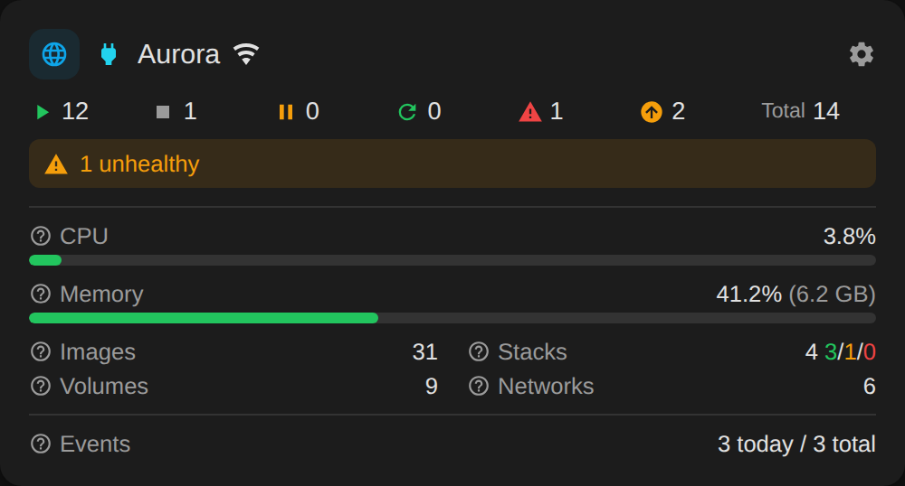
  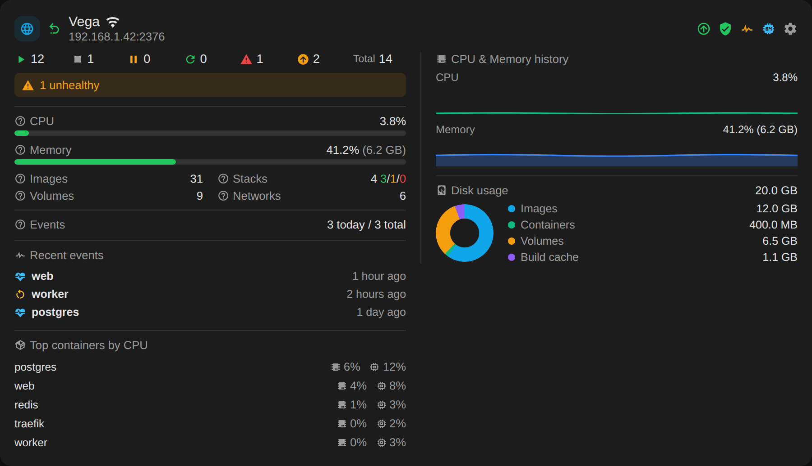
</p>

<details>
<summary>Compact and detailed modes</summary>
<p>
  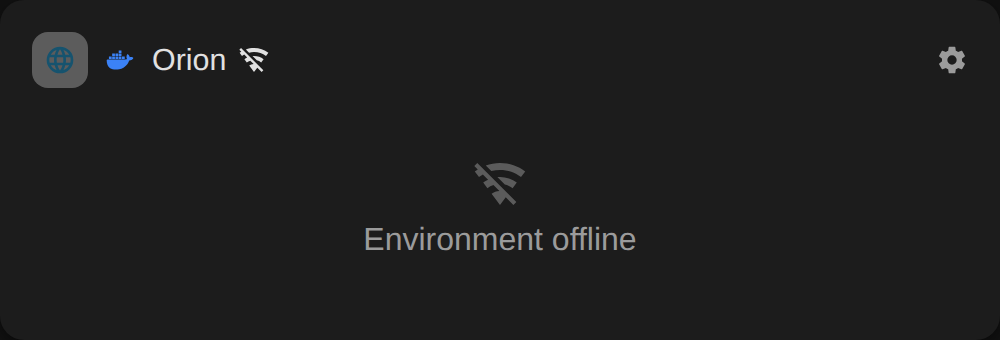
  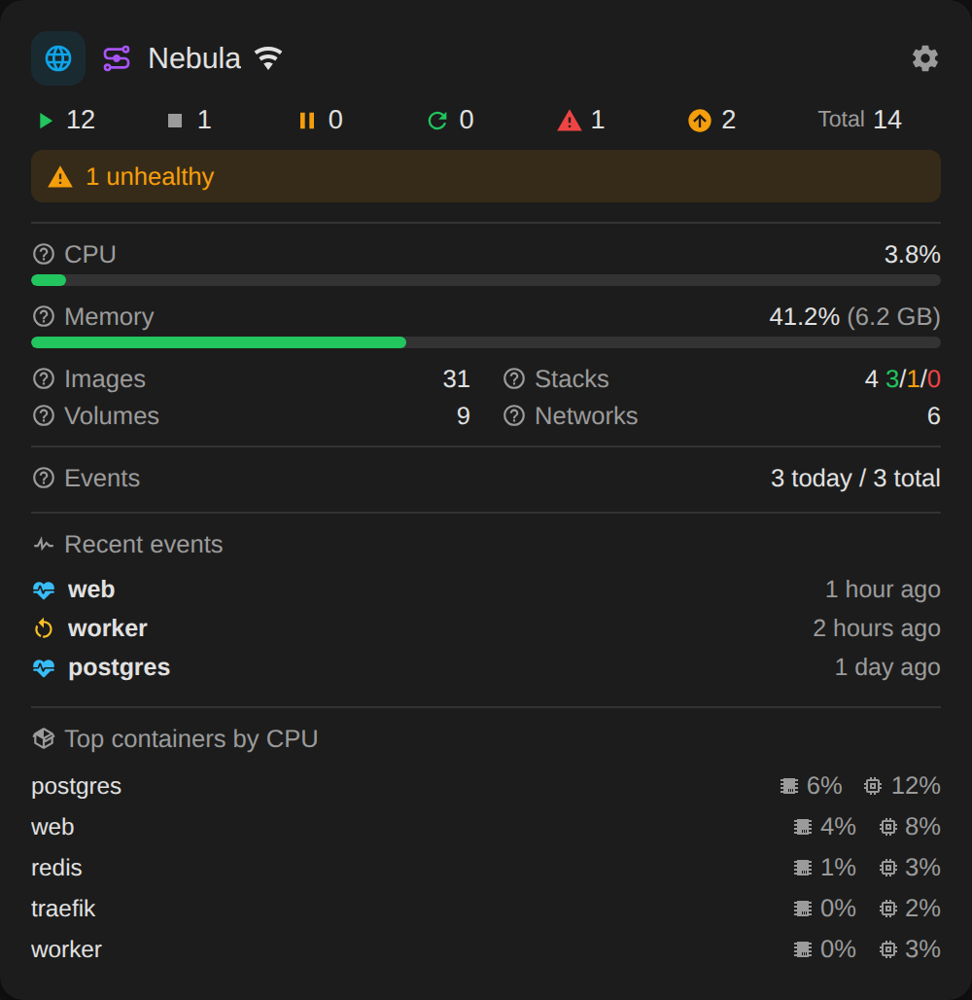
</p>
</details>

### Dockhand Vulnerability Card

```yaml
type: custom:dockhand-vulnerability-card
device_id: <environment device>
```

Total findings plus a critical/high/medium/low breakdown (Dockhand's own severity colors) and scan
coverage. Needs ha-dockhand's `sensor.vulnerabilities` (disabled by default) enabled, and
vulnerability scanning turned on for that environment in Dockhand.

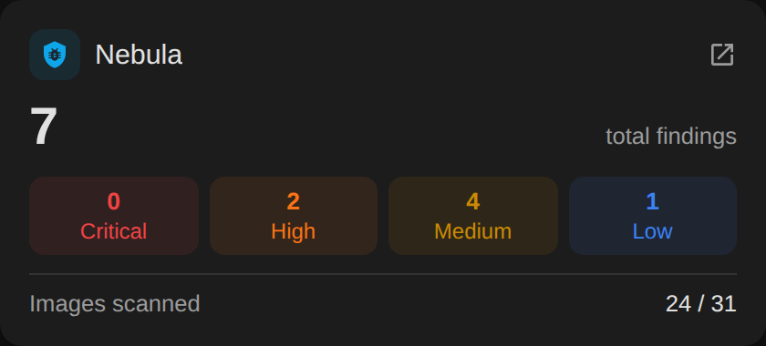

### Dockhand Stack Card

```yaml
type: custom:dockhand-stack-card
device_id: <stack device>
```

Status (running/partial/stopped/created), container count, pending-update badge, and — for
git-tracked stacks only — sync status, last sync time, and a sync-error banner.

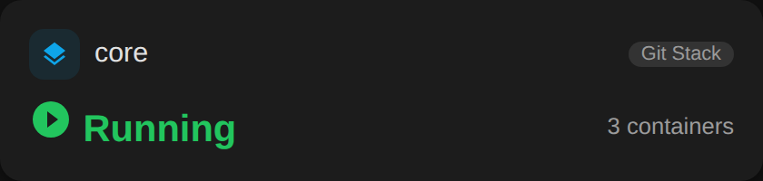

### Dockhand Container Card

```yaml
type: custom:dockhand-container-card
device_id: <container device>
```

State, health (when the container has a healthcheck), CPU/memory usage, and network/block I/O.
CPU/memory and per-container I/O sensors are opt-in in ha-dockhand and off by default — the card
shows a hint rather than a blank chart when they're not enabled. CPU, memory, and the health icon
each open their own entity's more-info dialog — not just the container's overall state.

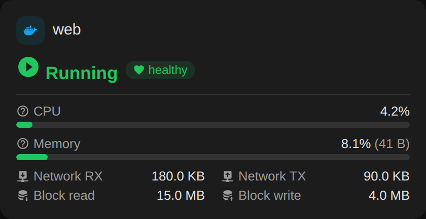

*The Stack and Container cards don't have a Dockhand dashboard tile to model directly — Dockhand
only shows this level of detail on its full stack/container detail pages, which have far more
going on than a dashboard card should. What's here is a first pass at "what's actually useful at a
glance"; feedback on what to add, cut, or rearrange is genuinely wanted.* Naming convention across
this repo: singular ("Stack", "Container") means one item; plural ("Stacks", "Containers") means
every item of that type for one environment.

### Dockhand Stacks Card

```yaml
type: custom:dockhand-stacks-card
device_id: <environment device>
```

Every stack in one environment, one compact row each (type, status, container count, pending
updates). Auto-detects every stack device for the selected environment — nothing else to
configure.

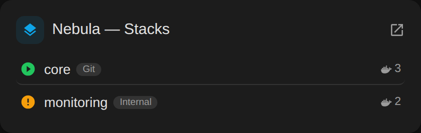

### Dockhand Containers Card

```yaml
type: custom:dockhand-containers-card
device_id: <environment device>
```

Every container in one environment, one compact row each (state, health, CPU/memory when those
sensors are enabled).

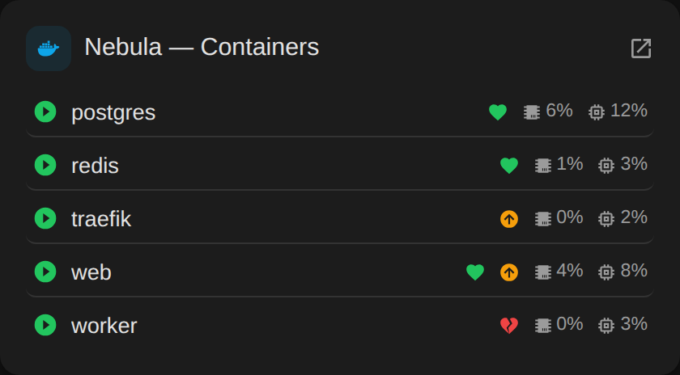

### Dockhand Updates Card

```yaml
type: custom:dockhand-updates-card
scope: all # all | environment
device_id: <environment device> # only used when scope: environment
hide_when_no_updates: false # uses HA's own card visibility condition - genuinely hidden, not just empty, and still shows normally while editing the dashboard
```

Every pending container update — across every environment, or just one — with a bulk "Update all"
action (presses ha-dockhand's own per-environment "Update all" button entity, so it's the exact
same batch semantics as clicking it in Dockhand itself: system containers excluded, matches
Dockhand's own count). Each row opens that container's own `update` entity more-info for a
targeted install instead.

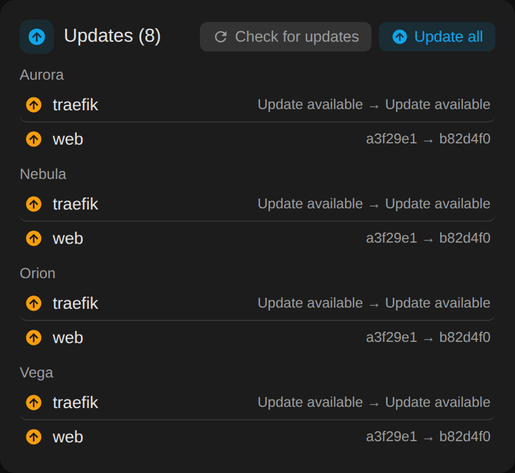

### Dockhand Overview

```yaml
type: custom:dockhand-overview-card
show_environments: true
show_vulnerabilities: false # needs the Vulnerabilities sensor enabled per environment
show_updates: false
updates_hide_when_no_updates: false # hides just that environment's Updates card (genuinely, taking no space), not the others
show_stacks: false
show_containers: false
environment_mode: standard # compact | standard | detailed | full | custom
environment_custom_sections: [container_counts, metrics, resources, events_summary] # only used when environment_mode: custom
```

Intended to fill an entire dashboard view. One column per environment (sorted by name), each
column stacking whichever sections you've enabled — the environment card, vulnerability card,
Updates card, Stacks card, and Containers card, in that order by default (drag to reorder in the
editor) — so everything about one environment lives together instead of being split into separate
rows per card type. Columns lay out side by side on a wide screen and collapse to one column at a
time, in the same order, on mobile — a plain flex-wrap, no separate mobile layout to maintain.

Defaults to environments only — turn on Vulnerabilities/Updates/Stacks/Containers if you want them.
Kept deliberately minimal by default: with everything on, this card gets very tall very fast (every
section, for every environment), and there's no reliable way for the card to know it's being
shown small versus on a real dashboard (see `docs/ARCHITECTURE.md` if you're curious why), so the
default has to work reasonably either way. If you just want a clean per-environment overview,
this default is probably already what you want.

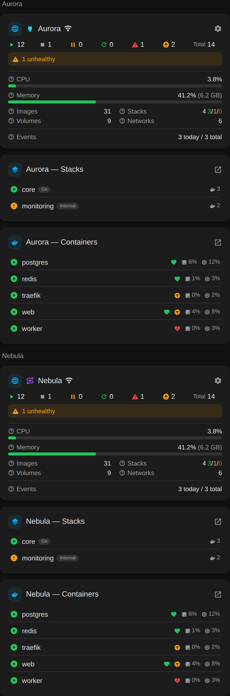

## Translations

Editor field labels and section headings are translated into the same 10 languages as
ha-dockhand (German, Spanish, French, Italian, Norwegian Bokmål, Dutch, Polish, Portuguese,
Swedish, Simplified Chinese), looked up from `hass.language`. Live-card-rendered text (e.g.
"Images", "CPU", "Events") is still English-only.

## Contributing

See `CONTRIBUTING.md` for development setup, testing against a real Home Assistant instance, and
the release process.
